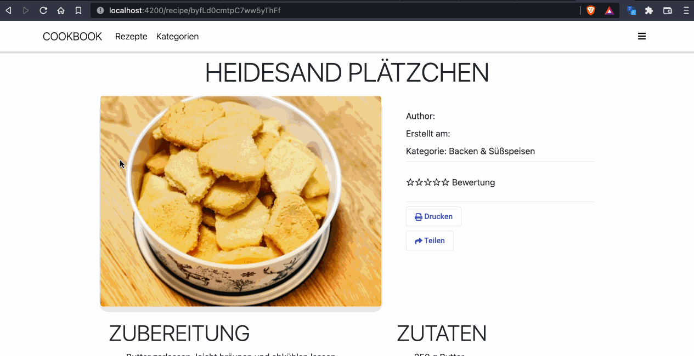

# Cookbook
I've been working from home since the beginning of the Corona Pandemic. However, the length of my lunch break has not increased, during this time I not only have to eat, but also cook. Not only for me, but also for my children. So every minute counts.

For this reason I have developed my own digital cookbook. In it I collect all the recipes I find, for example from the Internet, Pinterest, or from the many cookbooks on the bookshelf.

## Angular & Firebase

The project works entirely with Google Firebase for data storage, authentication and authorization, but also storing images.
https://firebase.google.com/ 

This project was generated with [Angular CLI](https://github.com/angular/angular-cli) version 12.2.10.

## Development server

Run `ng serve` for a dev server. Navigate to `http://localhost:4200/`. The app will automatically reload if you change any of the source files.

## Code scaffolding

Run `ng generate component component-name` to generate a new component. You can also use `ng generate directive|pipe|service|class|guard|interface|enum|module`.

## Build

Run `ng build` to build the project. The build artifacts will be stored in the `dist/` directory.

## Running unit tests

Run `ng test` to execute the unit tests via [Karma](https://karma-runner.github.io).

## Running end-to-end tests

Run `ng e2e` to execute the end-to-end tests via a platform of your choice. To use this command, you need to first add a package that implements end-to-end testing capabilities.

## Further help

To get more help on the Angular CLI use `ng help` or go check out the [Angular CLI Overview and Command Reference](https://angular.io/cli) page.

# MDB
https://medium.com/@reshailawan/how-to-install-md-bootstrap-in-your-angular-9-project-7eadd45a758d